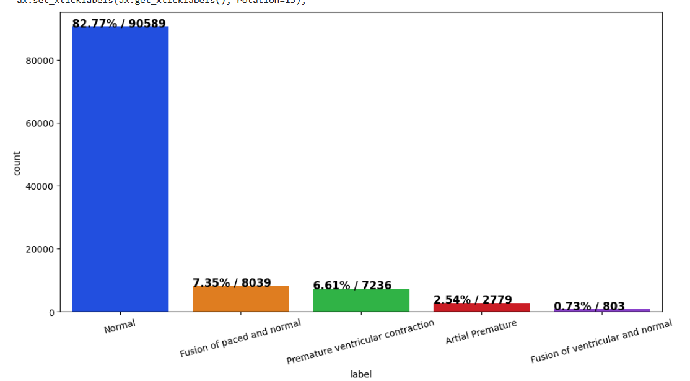
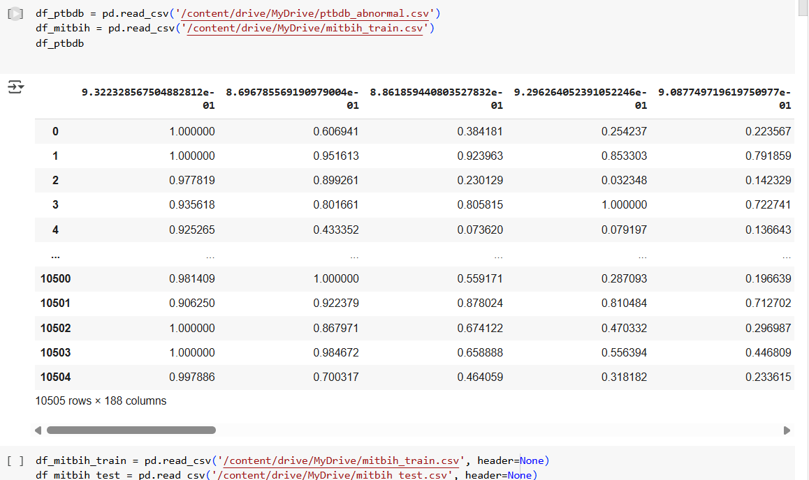
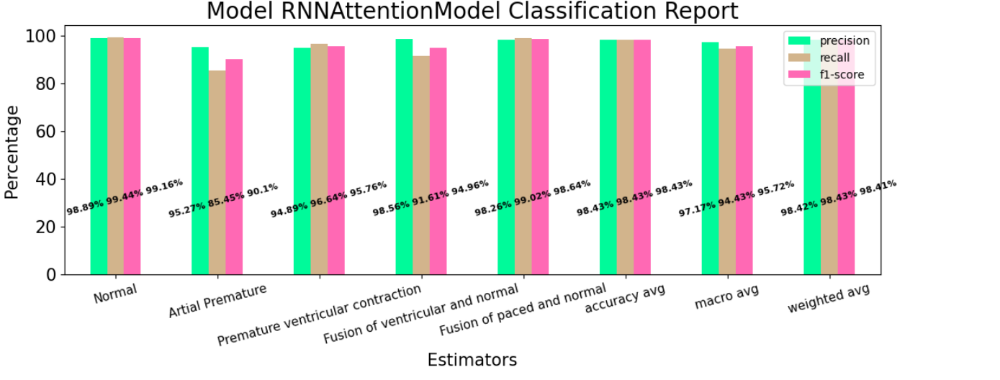
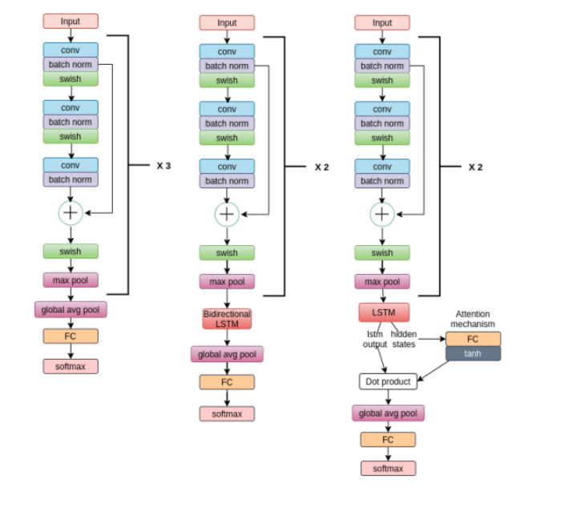
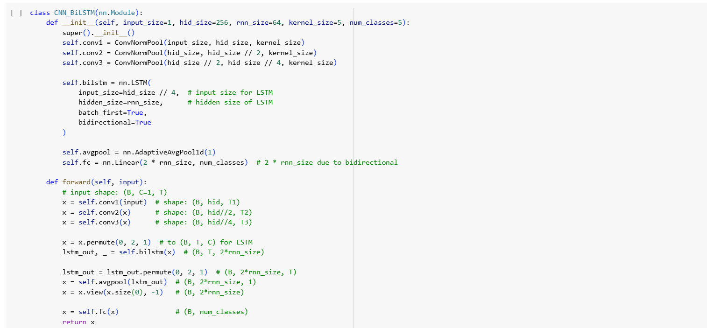
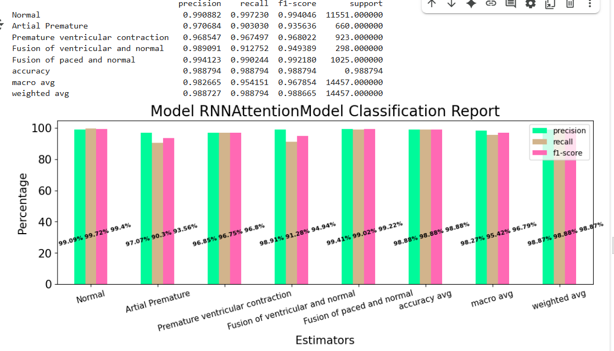
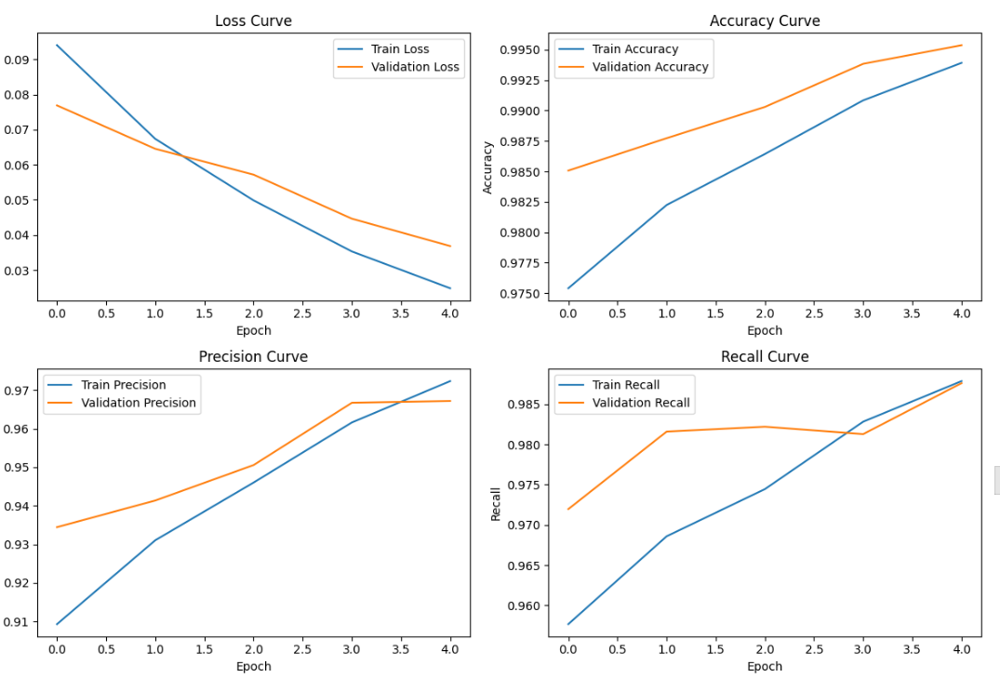

# ECG-Classification
Đây là các model dùng để phân loại nhịp tim ecg,sử dụng các mạng cnn,rnn,attention mode

DATA SETCG-Classification
Đây là các model dùng để phân loại nhịp tim ecg,sử dụng các mạng cnn,rnn,attention mode

DATA SET gôc được lấy từ https://www.kaggle.com/code/polomarco/ecg-classification-cnn-lstm-attention-mechanism/input

Bộ dữ liệu phân loại nhịp tim ECG

## Tóm tắt

Bộ dữ liệu này bao gồm hai bộ sưu tập tín hiệu nhịp tim được lấy từ hai bộ dữ liệu nổi tiếng trong phân loại nhịp tim: Bộ dữ liệu loạn nhịp tim MIT-BIH và Cơ sở dữ liệu ECG chẩn đoán PTB . Số lượng mẫu trong cả hai bộ sưu tập đều đủ lớn để huấn luyện một mạng nơ-ron sâu.

Bộ dữ liệu này đã được sử dụng để khám phá phân loại nhịp tim bằng kiến trúc mạng nơ-ron sâu và quan sát một số khả năng của học chuyển giao trên đó. Các tín hiệu tương ứng với hình dạng điện tâm đồ (ECG) của nhịp tim trong trường hợp bình thường và các trường hợp bị ảnh hưởng bởi các rối loạn nhịp tim và nhồi máu cơ tim khác nhau. Các tín hiệu này được xử lý sơ bộ và phân đoạn, với mỗi phân đoạn tương ứng với một nhịp tim.

### Nội dung

**Bộ dữ liệu loạn nhịp tim**
* Số lượng mẫu: 109446
* Số lượng danh mục: 5
* Tần số lấy mẫu: 125Hz
* Nguồn dữ liệu: Bộ dữ liệu rối loạn nhịp tim MIT-BIH của Physionet
* Các lớp: ['N': 0, 'S': 1, 'V': 2, 'F': 3, 'Q': 4]
* Cơ sở dữ liệu ECG chẩn đoán PTB
* Số lượng mẫu: 14552
* Số lượng danh mục: 2
* Tần số lấy mẫu: 125Hz
* Nguồn dữ liệu: Cơ sở dữ liệu chẩn đoán PTB của Physionet
* Lưu ý : Tất cả các mẫu đều được cắt, giảm mẫu và thêm số không nếu cần thiết theo kích thước cố định là 188 .

Tệp dữ liệu

Bộ dữ liệu này bao gồm một loạt các tệp CSV. Mỗi tệp CSV chứa một ma trận, với mỗi hàng đại diện cho một ví dụ trong phần đó của bộ dữ liệu. Phần tử cuối cùng của mỗi hàng biểu thị lớp mà ví dụ đó thuộc về.

Môi 1 tín hiêu ecg có 188 featu-Classification
Đây là các model dùng để phân loại nhịp tim ecg,sử dụng các mạng cnn,rnn,attention mode

DATA SETCG-Classification
Đây là các model dùng để phân loại nhịp tim ecg,sử dụng các mạng cnn,rnn,attention mode

DATA SET gôc được lấy từ https://www.kaggle.com/code/polomarco/ecg-classification-cnn-lstm-attention-mechanism/input

Bộ dữ liệu phân loại nhịp tim ECG
Tóm tắt
Bộ dữ liệu này bao gồm hai bộ sưu tập tín hiệu nhịp tim được lấy từ hai bộ dữ liệu nổi tiếng trong phân loại nhịp tim: Bộ dữ liệu loạn nhịp tim MIT-BIH và Cơ sở dữ liệu ECG chẩn đoán PTB . Số lượng mẫu trong cả hai bộ sưu tập đều đủ lớn để huấn luyện một mạng nơ-ron sâu.

Bộ dữ liệu này đã được sử dụng để khám phá phân loại nhịp tim bằng kiến trúc mạng nơ-ron sâu và quan sát một số khả năng của học chuyển giao trên đó. Các tín hiệu tương ứng với hình dạng điện tâm đồ (ECG) của nhịp tim trong trường hợp bình thường và các trường hợp bị ảnh hưởng bởi các rối loạn nhịp tim và nhồi máu cơ tim khác nhau. Các tín hiệu này được xử lý sơ bộ và phân đoạn, với mỗi phân đoạn tương ứng với một nhịp tim.

Nội dung
Bộ dữ liệu loạn nhịp tim
Số lượng mẫu: 109446
Số lượng danh mục: 5
Tần số lấy mẫu: 125Hz
Nguồn dữ liệu: Bộ dữ liệu rối loạn nhịp tim MIT-BIH của Physionet
Các lớp: ['N': 0, 'S': 1, 'V': 2, 'F': 3, 'Q': 4]
Cơ sở dữ liệu ECG chẩn đoán PTB
Số lượng mẫu: 14552
Số lượng danh mục: 2
Tần số lấy mẫu: 125Hz
Nguồn dữ liệu: Cơ sở dữ liệu chẩn đoán PTB của Physionet
Lưu ý : Tất cả các mẫu đều được cắt, giảm mẫu và thêm số không nếu cần thiết theo kích thước cố định là 188 .

Tệp dữ liệu
Bộ dữ liệu này bao gồm một loạt các tệp CSV. Mỗi tệp CSV chứa một ma trận, với mỗi hàng đại diện cho một ví dụ trong phần đó của bộ dữ liệu. Phần tử cuối cùng của mỗi hàng biểu thị lớp mà ví dụ đó thuộc về.

Môi 1 tín hiêu ecg có 188 feature
Trong đó 187 điểm điều chính là giá trị của tín hiệu đó theo điểm thời gian.Giồng như 1 video 30 giây được chia thành 30 input Xi.

Đặc trưng cuối cùng sẽ là nhãn của nó được đánh số từ 0 đến 4.Để phân loại ta sẽ phải gán lại nhãn tương ứng theo số.

id_to_label = {
    0: "Normal",
    1: "Artial Premature",
    2: "Premature ventricular contraction",
    3: "Fusion of ventricular and normal",
    4: "Fusion of paced and normal"
}

Sau đây là biểu đồ phân bố dữ liệu:

Ta thấy data set trên bị imbalance khá nặng.Điều này gây ra hiện tượng độ chính xác tổng thê của model phân loại sẽ khá cao nhưng độ chính xác trên từng nhãn có thể khá thấp.Tuy nhiên model được coi là tốt nếu độ  chính xác trên các nhãn bị ít dữ liệu cũng rất cao.

Hướng dẫn chạy:

Tải từng file trong data set về rồi thay lại đường link khai báo data trong note book:

Sau đó chạy từng block trong note book .Trong đó đợi model train xong và in báo cáo:

Phân tích công việc đã làm:

Việc của em đã làm là dựa vào bản thiết kế kiến trúc trên để dụng lại từng layer bằng thư viện pytorch.Qua đó hiểu được cách build và tuỳ chỉnh thiết kế 1 model hình.Em đã build và train tổng cộng 3 model trong bản thiết kết trên:

Trong đó kiến trúc trong 1 class được chia thành 2 phần 1 phần dùng để định nghĩa các phép toán có trong layer biểu đồ trên,còn tất cả thực hiện thuật toán trả về giá trị đều được thực hiện trong hàm def forward:

Mỗi một model đều có 1 phép toán cuối sofmax.Túc là tất cả các model đều biến các input đầu vào là các vector sofmax có 5 chiều vì ta có 5 nhãn:

Giả sử ta có vector sofmax sau:
[0.45,0.15,0.1,0.2,0.1].

Tức là tín hiệu có 45% là thuộc nhãn 0,15% nhãn 1,..

Sau đó em xây dựng hàm trainer và metric để trích xuất thông tin sau mỗi epoch.Tệp data set được chia thành 85% train và 15% val.Mỗi epoch có 2 pha 1 pha chạy trên tệp train ,1 pha đánh giá trên tệp val :

**3 chỉ số ngoài cùng có nghĩa là :**

🎯 1️⃣ accuracy avg

•	Ý nghĩa: Đây là độ chính xác tổng thể (overall accuracy).

•	Giá trị này chỉ ra tỷ lệ phần trăm các mẫu mà mô hình dự đoán đúng trên toàn bộ dataset.
________________________________________
🎯 2️⃣ macro avg

•	Ý nghĩa: Đây là macro-average — tính trung bình các chỉ số (precision, recall, F1) cho tất cả các class, mà không xét đến tỷ lệ xuất hiện của mỗi class.

•	Cách tính:
1. Tính precision, recall, F1 cho từng class riêng.
2. Sau đó lấy trung bình cộng của tất cả các class.

•	Khi nào quan trọng:
Macro avg hữu ích khi bạn muốn xem mô hình hoạt động công bằng thế nào giữa các class, đặc biệt nếu dataset bị mất cân bằng.
________________________________________
🎯 3️⃣ weighted avg

•	Ý nghĩa: Đây là weighted-average — cũng tính trung bình các chỉ số cho tất cả các class nhưng có tính đến tỷ lệ mẫu của từng class.

•	Cách tính:
1. Tính precision, recall, F1 cho từng class.
2. Mỗi class được cân trọng số theo số mẫu thực tế của class đó.

•	Khi nào quan trọng:
Weighted avg cho biết hiệu suất chung thực tế, phản ánh rõ hơn với dataset mất cân bằng vì nó ưu tiên những class lớn.

 **Các chỉ số đánh giá:**
 
**1.Precision**

* Ý nghĩa: Trong số các mẫu dự đoán là Positive, có bao nhiêu mẫu thật sự đúng.

* Công thức: Precision = TP / (TP + FP)

  * TP = True Positive (Dự đoán đúng Positive)
  * FP = False Positive (Dự đoán sai Positive)

**2.Recall**

* Ý nghĩa: Trong số các mẫu thật sự là Positive, mô hình phát hiện ra bao nhiêu.

* Công thức: Recall = TP / (TP + FN)
  * TP = True Positive
  * FN = False Negative (Bỏ sót, dự đoán sai là Negative)

**3.F1-score**

* Ý nghĩa: Trung bình điều hòa giữa Precision và Recall. Cân bằng giữa việc dự đoán đúng Positive và bắt được hết Positive.

* Công thức: F1 = 2 * (Precision * Recall) / (Precision + Recall)

**Đánh giá:**

-Ưu điểm:

* Tất cả các model đều cho ra độ chính xác và độ phủ cao với 1 nhẫn bất chấp bị mất cân bằng dữ liệu.
Điều đó cho thấy model có sự nhân diện các nhãn rất hiệu quả.

* Model cũng khng hề có dấu hiệu bị overfitting,các chỉ số đánh giá ều tăng sau mỗi epoch cả trên tập train và test.

-Hạn chế :

* Vẫn chưa tối ưu được 2 model sử dụng rnn và attention mode.Nên cho dù chỉ số các model này vẫn rất cao nhưng lại không hiệu quả bằng CNN model,do sử dụng các phép toán nhẹ nên tính toán nhanh hơn.

**Tính chất dự án:**

Đây là dự án cá nhân.